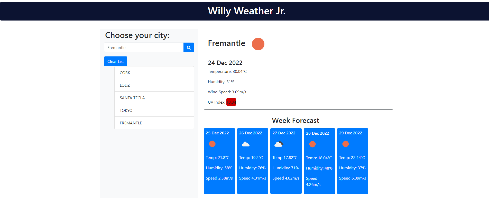

# Willy Weather Jr.
## Description
The following 'Weather Dashboard' is an application to find a weather condition of a given city both the current and 5-Days forecast at the same time.
The current weather displayed data includes:
- City, Date, Icon-image
- Temperature
- Humidity
- Wind Speed
- UV index

The 5-day forecast displays the following information on each card:
- Date
- Weather Icon image
- Temperature
- Humidity

-------------------

## Instructions
1. Click on the provided URL for the deployed site.
2. Enter the name of a city.
3. Check the information.
4. To clear the list of cities use the 'Clear' button.

## Installation

N/A

--------------------

## Submission Links

### GitHub: 

### Deployed URL: https://github.com/MoMoncada/willy-weather-jr

---------------------

## Deployed Web Page

### Willy Weather Jr.

## Credits
Maria Auxiliadora Moncada 
------------ 

## License
N/A

